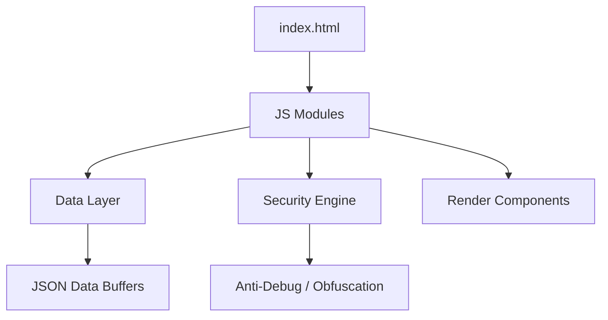

# <div align="center">🚀 {codeia} - Portafolio Premium</div>

<div align="center">
  
  
</div>

<br />

<div align="center">
  
</div>

## 👤 El Ingeniero detrás del Código

<div align="center">
  <table border="0">
    <tr>
      <td width="50%">
        <h1>Gonzales Huaromo Yelsen Fernández</h1>
        <p><b>Software Engineer & Full Stack Developer</b></p>
        <p>Transformando ideas complejas en realidades digitales escalables con un enfoque en la experiencia de usuario y la seguridad de alto nivel.</p>
        <br />
        <a href="https://linkedin.com/"></a>
        <a href="https://yelsen-gonzales-huaromo.github.io/"></a>
      </td>
      <td width="50%" align="center">
        
      </td>
    </tr>
  </table>
</div>

---

## ⚡ Tech Stack Dynamic

<p align="center">
  
</p>

---

## 🛠️ Innovaciones del Portafolio

<div align="center">
  
</div>

<table>
  <tr>
    <td width="50%">
      <h3>🎨 Diseño Futurista</h3>
      <ul>
        <li>Interfaz Glassmorphism ultra-limpia</li>
        <li>Modo Oscuro con persistencia local</li>
        <li>Animaciones AOS suaves y fluidas</li>
      </ul>
    </td>
    <td width="50%">
      <h3>🔐 Seguridad Robusta</h3>
      <ul>
        <li>Protección Anti-Clone avanzada</li>
        <li>Ofuscación de código JavaScript</li>
        <li>Bloqueo de DevTools y clic derecho</li>
      </ul>
    </td>
  </tr>
</table>

---

## 📂 Arquitectura del Sistema



---

## 🚀 Despliegue Rápido

```bash
# Clonar el ecosistema {codeia}
git clone https://github.com/yelsen-gonzales-huaromo/yelsen-gonzales-huaromo.github.io.git

# Lanzar servidor de desarrollo
npx serve .
```

---

<div align="center">
  
</div>

<div align="center">
  <b>Hecho con ❤️ por Yelsen Gonzales</b><br />
  <span>Innovación | Rendimiento | Seguridad</span>
</div>
